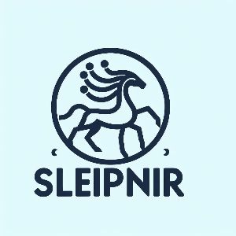

## What is Sleipnir?

Sleipnir is a cross-platform C99 library for writing neural networks


## Getting Started

This guide will help you get up and running with the project.

## Prerequisites

Before you begin, ensure that you have the following installed on your system:

- **Git**
- **CMake 3.13+**
- **Clang/GCC**

## Quickstart

Follow these steps to build `sleipnir`:

*Build `vigenere_decrypter` command line application:*
```shell
git clone https://github.com/neural-sleipnir/sleipnir.git
cmake -S. -Bbuild -DBUILD_TESTING=OFF -DCMAKE_BUILD_TYPE=Release
cmake --build build --config Release -j
```

*To run tests use the following commands:*
```shell
cmake -S. -Bbuild -DBUILD_TESTING=ON -DCMAKE_BUILD_TYPE=Debug
cmake --build build --config Debug -j
cmake --build build --config Debug --target test
```